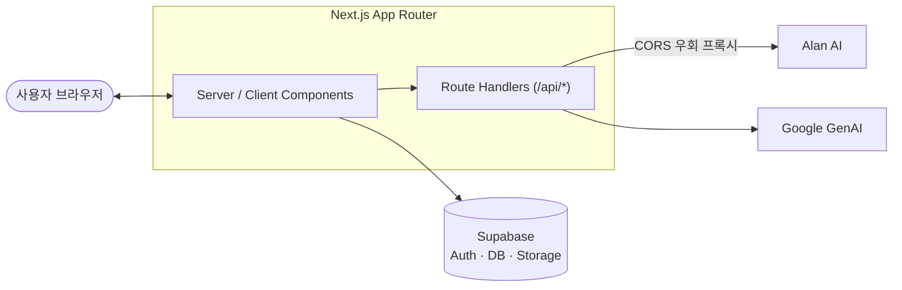

# CallBack

AI 기반 개발자 취업 준비 플랫폼입니다. 이력서·자기소개서 작성부터 AI 면접 연습, 포트폴리오 관리, 기업 탐색까지 취업 준비의 전 과정을 한 곳에서 지원합니다.

- 제작 기간: 2026.07.15 ~ 2026.08.21
- 배포: [est-fe-13-3rd-project.vercel.app](https://est-fe-13-3rd-project.vercel.app/)
- 저장소: [github.com/soomln/est_fe_13_3rd_project](https://github.com/soomln/est_fe_13_3rd_project)

## 주요 기능

| 기능 | 설명 | 상태 |
| --- | --- | --- |
| 이력서·자기소개서 | 무료 양식 기반 작성, AI 첨삭/코칭 | 구현 완료 |
| 포트폴리오 | 등록·관리, 좋아요/북마크, 상세 모달 | 구현 완료 |
| AI 면접 연습 | AI 예상 질문 생성, 답변 평가, 스크랩 | 구현 완료 |
| 기업 탐색 | 연봉·평점·복지·후기 확인 | 구현 완료 |
| 마이페이지 | 계정/활동/문서/스크랩/포트폴리오 통합 관리 | 구현 완료 |
| 로그인/회원가입 | 소셜 로그인(OAuth) | 구현 완료 |
| 팀 프로젝트, 커뮤니티 | 팀원 모집, 자유 게시판 | 준비 중 |

## 기술 스택

**Frontend**
- Next.js 16 (App Router), React 19
- SASS Modules
- Swiper.js, dnd-kit, Chart.js, Tiptap 에디터
- html2canvas, jsPDF (문서 내보내기)

**Backend / Infra**
- Supabase (Auth, Database, Storage)
- Next.js Route Handlers (외부 API 프록시 등)

**AI 연동**
- Alan AI (면접 예상 질문, 코칭)
- Google GenAI

**Testing**
- Vitest (unit / e2e)

## 아키텍처



- 브라우저에서 외부 AI API(Alan AI)를 직접 호출하면 CORS로 차단되기 때문에, Next.js Route Handler가 서버에서 대신 호출하는 프록시 역할을 합니다.
- 인증·데이터·파일 저장은 Supabase를 통해 처리합니다.

## 팀 구성 및 담당

| 역할 | 이름 | 담당 |
| --- | --- | --- |
| 팀장 | 장도담 | 백엔드, 이력서·자소서, 마이페이지, 로그인·회원가입, 기업 탐색 UI |
| 서기 | 김소영 | 기업 탐색, AI 면접 코칭 |
| 올라운더 | 박소영 | 포트폴리오, 공통 컴포넌트, 전 페이지 서포트 |
| 팀원 | 송주윤 | 기업 탐색 마크업·기능 |
| Git 관리자 | 최수민 | 메인, 헤더·푸터·공통 컴포넌트 |

## 시작하기

### 1. 설치

```bash
npm install
```

### 2. 환경 변수 설정

프로젝트 루트에 `.env.local` 파일을 만들고 아래 값을 채워주세요.

```bash
# Supabase
NEXT_PUBLIC_SUPABASE_URL=
NEXT_PUBLIC_SUPABASE_PUBLISHABLE_KEY=

# Alan AI
NEXT_PUBLIC_ALAN_BASE_URL=/api/alan
NEXT_PUBLIC_ALAN_CLIENT_ID=
ALAN_BASE_URL=
```

### 3. 개발 서버 실행

```bash
npm run dev
```

[http://localhost:3000](http://localhost:3000) 에서 확인할 수 있습니다.

### 4. 테스트

```bash
npm run test        # unit
npm run test:e2e    # e2e
npm run test:all    # 전체
```

## 폴더 구조

```
src/app
├── _components/       # 공통(common) · 페이지별(main 등) 컴포넌트
├── api/                # Next.js Route Handlers
├── auth/               # 소셜 로그인 콜백
├── resume/             # 이력서·자소서
├── portfolio/          # 포트폴리오
├── interview/          # AI 면접 연습
├── search-companies/   # 기업 탐색
└── mypage/             # 마이페이지

backend/
├── lib/api/            # 백엔드 API 함수 모음
└── supabase/           # DB 스키마, 시드 데이터
```
